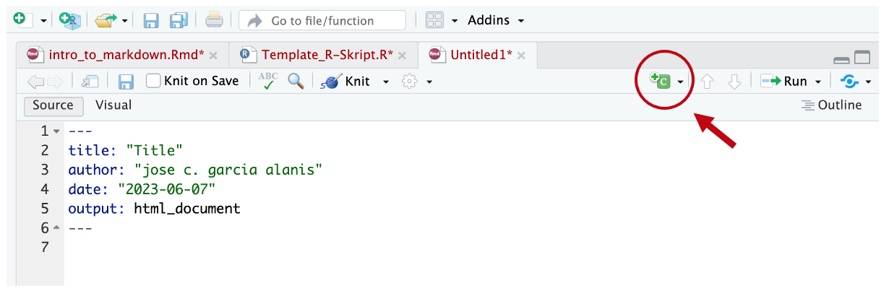

```{r echo = FALSE}
knitr::opts_chunk$set(echo = TRUE, dev="cairo_pdf")
```

# Inhalte dieser Übung

- Was ist R-Markdown?
- Warum ist es eine gute Idee, R Markdown zu lernen?
- Wie kann ich eine R Markdown Datei erstellen?
- Wie kann ich eine R Markdown als PDF exportieren?

# Erste Schritte mit **R-Markdown**

## Was ist R Markdown?

**R Markdown** ist eine sehr zugängliche und einfache Methode, R-Skripte zu dokumentieren und reproduzierbar zu machen. Häufig wird als „großer Nachteil“ von R-Skripten genannt, dass man keinen einfachen Text in einem R-Skript aufnehmen kann. Alles, was wir in einem R-Skript „schreiben", muss in der R-Syntax geschrieben sein, sonst läuft das Skript nicht. Text-Erklärungen zum „R-code“ können höchstens als Kommentar eingefügt werden (diese werden von einer Raute `#` vorangegangen).

R Markdown bietet eine einfache Lösung für dieses Problem an.

## Ist R-Markdown eine (weitere) Programmiersprache?

Nicht ganz. R-Markdown ist ein spezielles Dateiformat und eine Syntax für dieses Dateiformat. Diese Syntax macht das Benutzen von Markdown-Befehlen in R extrem einfach. Im Hintergrund läuft **Markdown**, eine sehr einfache “Markup”-Sprache (ähnlich wie `html`), die Befehle zur Erstellung von Dokumenten aus einer reinen Text-Datei bereitstellt. Wir können Markdown-Dokumente in viele andere Dateitypen wie `.html` oder `.pdf` umwandeln. Dabei können Überschriften, Bilder automatisch generiert und anzuzeigen, während die ursprüngliche R-Datei "unverändert" bleibt und in einer Art formatiert ist, dass sie leicht zu lesen ist. Zum Beispiel, die Datei, die Sie gerade lesen, haben wir mit R-Markdown erstellt. Das R-Buch, was Sie während des R-Tutoriums im ersten Teil des Semesters kennengelernt haben, haben mit R-Markdown erstellt.

Also keine Sorge, sie müssen die keine weitere „Programmiersprache“ lernen.
Sie müssen Ihre R-Skripte „nur“ in einem anderen Dateiformat (als `.Rmd` Datei) abspeichern und einige wenige Formatierungsregeln einhalten.

## Warum R-Markdown?

R Markdown ermöglicht uns, R-Skripte unkompliziert zu dokumentieren.
R Markdown Dokumente können als eine Art "Analyse-Protokoll" für die von uns durchgeführten Analysen benutzt werden. Forschung ist nur dann wirklich reproduzierbar, wenn andere Forscher:innen leicht verstehen können, was wir in unseren Analysen getan haben. Ohne Analyse-Protokollen und Dokumentation kann niemand wirklich verstehen, warum und wie genau wir manche Analysen durchgeführt haben. Manchmal ist es auch für uns selbst nur teilweise nachvollziehbar, warum wir frühere Analysen so durchgeführt haben, wie wir sie durchgeführt haben. Es ist deswegen hilfreich, ein R Markdown-Dokument als Anhang zu einer Arbeit (z.B. Masterarbeit oder Projektarbeit) zu erstellen. Wir können dann das dieses Dokument auf ein Online-Repositorium (z.B. das Open-Science-Framework) hochladen, oder es einfach als persönliche Aufzeichnung behalten. Wenn wir zu einem späteren Zeitpunkt auf unseren Code blicken, können wir dann leicht nachvollziehen, was wir getan haben und warum wir das so getan haben.

Der Vorteil von R Markdown Dokumenten ist, dass sie sowohl Code (z.B. R-Code, was wir benutzt haben, um eine Grafik zu generieren) und das Resultat von eben diesem Code (z.B. die Grafik, die wir damals erstellt haben) enthalten. Zusätzlich können wir Text-Erklärungen einfügen, und zwar so, wie wir das bei einem Word-Dokument machen würden. Einfach als (reiner) Text.

R Markdown Dokumente sind also ein bisschen wie ein Notizbuch. Dort stehen die Ziele unserer Analysen, gefolgt von den Schritten, die wir gefolgt sind, um diese Ziele zu erreichen, die Methoden, die wir angewendet haben und schließlich die Ergebnisse, die wir mit diesen Analysen erzielen konnten.

## R Markdown herunterladen

Um sicherzugehen, dass `rmarkdown` bei Ihnen installiert ist, benutzen Sie den folgenden R-Befehl, um `rmarkdown` jetzt zu installieren.

```{r eval = FALSE}
install.packages("rmarkdown")
```

# Erstellen Sie eine R-Markdown-Datei (`.Rmd`)

#### Übung 1

> Wenn wir eine R-Markdown-Datei (`.Rmd`) mit R-Studio erstellen möchten, müssen wir dies über das Datei-Fenster tun.
>
> 
> 1. Öffnen Sie R-Studio (falls Sie dies nicht ohnehin schon getan haben).
> 2. Gehen Sie nun oben links auf das „Neue Datei Symbol” (ein weises Viereck mit einem grün-weißen Plus-Zeichen).
> 3. Dann wählen Sie „R Markdown …“
> - Alternativ könne sie das Ganze über das Datei-Fenster oben Links erledigen (Datei -> Neues Dokument -> R Markdown…)
> 
> Sie werden merken, dass R-Studio ein keines Dialog-Fenster öffnet. Dort können Sie ein Name für das R Markdown Dokument und andere Einstellungen festlegen.
> 
> 1. Geben Sie unter Titel **rmarkdown-101**
> 2. Geben Sie unter Autor ihr Name an
> 3. Wählen Sie als Output-Format: **HTML**

Für jetzt konzentrieren wir uns auf ein `.html`-Dokument, das später leicht in andere Dateitypen umgewandelt werden kann.

R-Studio erstellt einen neue `.Rmd` Datei. Diese sollte automatisch aufgegangen sein. Die neu erstellte `.Rmd`-Datei enthält Beispiele und Code. Wir möchten allerdings unser eigenes R Markdown-Skript erstellen. Löschen also erst ein mal, was in der neu erstellten `.Rmd`-Datei enthalten ist.

Wir erstellen jetzt in gewisser Hinsicht eine Master R Markdown Datei. Wenn Sie eigene R-Skripte haben, die Sie in ein R Markdown-Dokument umwandeln möchten, können Sie diese Datei als Beispiel verwenden!

## Das `YAML`-Header

Am Anfang jedes R Markdown-Skripts steht ein sogenannter **YAML-Header**. Dieser wird durch **`---`** eingeschlossener (drei Bindestriche oben und unten). Standardmäßig enthält dieser einen Titel, Autor, Datum und den Dateityp. Der Dateityp ist das Format, in dem unser R Markdown Skript am Ende haben wollen. Es stehe uns viele verschiedenen Optionen für das YAML-Header stehen zur Verfügung. Heute werden wir uns mit dem absoluten Minimum beschäftigen.

Hier ist ein Beispiel für ein YAML-Header. Sie können dieses Beispiel auch für zukünftige Dateien benutzen.

```{markdown}
---
title:  "Einführung in Markdown"
author: José
date:   7. Juni 2023
output: html_document
---
```

Standardmäßig werden der Titel, Autor, Datum und Ausgabeformat am Anfang Ihres .html-Dokuments gedruckt. Dies ist das Minimum, was Sie in Ihren Headerbereich einfügen sollten.

#### Übung 2

> Kopieren Sie den oberen `YAML-Header`, fügen Sie diesen in der von Ihnen erstellten `.Rmd`-Datei ein und bearbeiten Sie ihn.
> Geben Sie Titel, Autor und Datum ein.
> Das Argment `output: html_document` kann so bleiben.

Jetzt, da wir unseren ersten Inhalt haben, können wir die `.Rmd`-Datei testen, indem wir sie zu `.html` kompilieren (auch "rendern" genannt). Um die `.Rmd`-Datei in ein `.html`-Dokument zu konvertieren, klicken wir auf den `Knit`-Knopf in der Taskleiste (dieses sieht so aus: {width=20, height=20} **knit**). (`knit` *engl.* für Stricken)

R-Studio öffnet dann ein separates Vorschaufenster, um die Ausgabe der `.Rmd`-Datei anzuzeigen. Wenn Sie möchten, dass die Ausgabe im Viewer-Fenster in R-Studio angezeigt wird (demselben Fenster, in dem Sie Grafiken sehen würden), wählen Sie "Vorschau in IDE Fenster" aus dem Dropdown-Menü, das erscheint, wenn Sie auf Einstellungen-Zahnradsymbols neben dem knit-Button klinken.

## Markdown Syntax

Sie können ganz normal in dem R Markdown Dokument schreiben. Der Text wird dann beim `knitten` in die Output-Datei geschrieben. Des Weiteren können Sie Markdown-Syntax in Ihrem R Markdown Dokument verwenden. Sobald Sie Ihr Dokument zusammenfügen, wird der Ausgabetext gemäß den folgenden einfachen Regeln formatiert.

### Formatierungsregeln

Fettgedruckter Text kann folgendermaßen geschrieben werden:

```{markdown}
**fettgedruckter Text**
```

Wenn etwas Text also durch `*`-Zeichen eingeschlossen wird, wird alles, was sich innerhalb der `*`-Zeichen befindet **fett**
gedruckt.

Die obige Schreibweise gibt folgendes Resultat:

**fettgedruckter Text**

Ähnlich verhält es sich mit *kursiver Text*

```{markdown}
*kursiv*
```

wird zu:

*kursiv*

Wenn wir etwas als Code (z.B. R-Code) ausweisen wollen, können wir den Text durch Grave-Akzente ( ` ) umschließen, wie hier:


```{markdown}
`code`
```

wird in einem R Markdown Dokument zu:

`code`

(die Schrift hat sich etwas geändert).

Titeln und Subtiteln stellen eine weitere Besonderheit dar. Wir können die Größe der Titel-Schrift durch die Anzahl an `#`-Symbolen, die den Text vorangehen, kontrollieren.

Die folgende Schreibweise 

```{markdown}
# Titel

## Subtitel

### Sub-Subtitel
```

wird beim *knitten* werden zu:

# Titel

## Subtitel

### Sub-Subtitel

Bisher haben wir das `#`-Symbol in R-Skripten dafür benutzt Kommentare einzufügen. In einem R Markdown Dokument benutzen wir das `#`-Symbol im Text, um die Größe der Überschriften zu steuern.

### Übung 3

> Kopieren Sie nun den folgenden Text und fügen Sie ihn in der von Ihnen erstellten R Markdown Datei. Fügen Sie den Text unterhalb von YAML-Header.
> **knitten** Sie anschließend das Dokument neu.

```{markdown}
# Erste Schritte mit R Markdown

Markdown ist **sehr einfach** :)
```

Unter dem YAML-Header befindet sich also der Bereich, in dem wir schreiben können, was wir wollen. Text kann mit der obigen Syntax formatiert werden. 

## R-Code in R Markdown Dateien einfügen

Ein Markdown Dokument kann ebenfalls R-Code enthalten, das beim **knitten** „ausgeführt“ werden soll. Das heißt, dass R im Hintergrund die Operationen durchführen wird, und dann im „geknitteten“ Dokument das Resultat schreiben wird.
Codeblöcke in einem `.Rmd`-Dokument werden von drei rückwärtsgewandten Apostrophen ``` (Grave-Akzenten) eingeschlossen sein. Diese sind als Codeblöcke bekannt und sehen so aus:

````{markdown}
```{r}
norm <- rnorm(100, mean = 0, sd = 1)
plot(density(norm))
```
````

Innerhalb der geschweiften Klammern befindet sich ein Bereich, in dem Sie Regeln für diesen Codeblock festlegen können. Der oben gezeigte Codeblock besagt, dass der Code R-Code ist (wir werden später auf einige andere Regeln für geschweifte Klammern eingehen).

### Übung 4

> Kopieren Sie das obige Codeblock und fügen Sie es in Ihrer `.Rmd`-Datei ein.
> **knitten** die Datei neu.

Sie können neue Codeblöcke auch mit diesem kleinen Button in R-Studio.



#### Übung 5

**Mehr Codeblöcke**

Es ist wichtig zu bedenken, dass wenn wir eine R Markdown Datei erstellen, in der wir Code ausführen möchten, der sich auf ein Objekt bezieht, zum Beispiel:

````{markdown}
```{r}
daten
```
````

müssen wir Anweisungen einfügen, die R sagen, was das Objekt `daten` ist. Ähnlich wie wir das in einem normalen R-Skript tun würden. 

Zum Beispiel:

````{markdown}
```{r}
daten <- c(1, 2, 3, 4, 5)
```
````

Wenn wir versuchen uns `daten` Anzeigen zu lassen (wie in dem vorherigen R Codeblock), ohne `daten` vorher zu definieren, wird R Markdown die Erstellung des Dokuments stoppen und uns ein Fehler mitteilen.

#### Übung 6

> Versuchen den obigen Codeblock in Ihrer `.Rmd`-Datei einzufügen, ohne vorher `daten` zu definieren. **knitten** Sie das Dokument neu. Was passiert?
> Definieren Sie nun `daten` bevor Sie auf `daten` zugreifen und **knitten** Sie neu. Was passiert?

## Wrap-Up

Nun kennen Sie die R Markdown Syntax. Es gibt prinzipiell viel mehr, was man zu Markdown erzählen könnte.
Das was wir heute geübt haben sind die "basics".

Sollten Sie mehr über R Markdown lernen wollen, lohnt die offizielle Einleitung auf der Website vom R-Studio.

- Hier ist der Link: https://rmarkdown.rstudio.com/lesson-1.html

Ansonsten können Sie sich die R Markdown "cheatsheet", die offiziell von R Studio bereitgestellt wird:

- R Markdown cheatsheet https://github.com/rstudio/cheatsheets/raw/main/rmarkdown-2.0.pdf

Viel Erfolg beim Coden! :)
